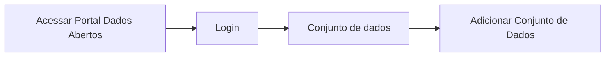

# Edição dos dados do Recurso

**Como** publicador, **eu quero**  fazer o upload do(s) arquivo(s) de dados, **para** que eu possa fazer a edição dos metadados do(s) arquivo(s) de dados.

- **Acesso:** 

- **Perfil de acesso:** Publicador. 
- **Protótipo:** Baixa Fidelidade.

- **Regra negocial:** Para que os metadados possam ser editados, o sistema deve se comportar conforme as regras abaixo:

	- **RN001:** Manter a conformidade com a especificação da Frictionless 
	- **RN002:** Possibilitar ao Administrador do Portal (que vai instalar a biblioteca) a opção de configurar os campos/propriedades da biblioteca informando os campos que deverão ser de preenchimento obrigatório. 
	- **RN003:** - Possibilitar ao Administrador do Portal (que vai instalar a biblioteca) a opção de configurar os campos/propriedades da biblioteca, informando quando os campos deverão ser restritos a edição. 
	- **RN004:** Os campos dos formulários deverão estar em conformidade com a especificação da Frictionless e à configuração do Administrador do Portal.
	- **RN005:** Para que seja feita a edição dos metadados do Dicionário de Dados e dos Dados do Recurso, o(s) arquivo(s) de dados deve ser em formato tabular.
	- **RN006:** - Ao carregar um arquivo(s) de dados `não` tabular, o sistema habilita apenas a edição dos campos dos Dados do Recurso. 
	- **RN007:** No agrupamento Dicionário de Dados, no campo `Tipo de dados`, a combobox deve vir preenchida, inferida pela Frictionless[^1] , podendo ser editado.
	- **RN008:** No agrupamento Dicionário de Dados, no campo `Formato de dados`, a combobox deve vir preenchida, inferida pela Frictionless[^1], podendo ser editado.
    - **RN009:** No agrupamento Dicionário de Dados, no campo `Obrigatório`[^2], a combobox tem a seguinte apresentação:
        - Deverão conter as opções *SIM* e *NÃO* 
        - Por padrão, deverá vir selecionada a opção *NÃO*, podendo ser editável, a depender da configuração do Administrador do Portal.  
	- **RN010:** No agrupamento Dicionário de Dados, no campo `Único`[^3], a combobox tem a seguinte apresentação:
    	- Deverão conter as opções *SIM* e *NÃO*
    	- Por padrão, deverá vir selecionada a opção *NÃO*, podendo ser editável, a depender da configuração do Administrador do Portal.  
    - **RN011:** No agrupamento Dados do Recurso no campo `Tipo do Recurso`[^4] a combobox deve vir preenchida, inferida pela Frictionless[^1], podendo ser editado, a depender da configuração do Administrador do Portal.  
    - **RN012** No agrupamento Dados do Recurso o campo `Formato do Recurso`[^4] o campo texto deve vir preenchido, inferido pela Frictionless[^1], podendo ser editado, a depender da configuração do Administrador do Portal.  
    - **RN013:** No agrupamento Dados do Recurso o campo `Encoding`[^4] o campo texto deve vir preenchido, inferido pela Frictionless[^1], podendo ser editado, a depender da configuração do Administrador do Portal.
    - **RN014:** Após a publicação do conjunto de dados, a edição de um recurso ou adição de um novo, só poderá ser feita uma de cada vez. 

### Critérios de aceite

- **Critério 001 – Editar Metadados de arquivo(s) de dados tabulares do Dicionário de Dados:**
	- **Dado**  que eu quero fazer a edição dos metadados do Dicionário de Dados e dos Dados do Recurso. 
	- **Quando** o sistema apresentar as informações inferidas deste campo.
	- **Então** escolho a opção que desejo editar e faço a edição.

- **Critério 002 – Editar Metadados de arquivo(s) de dados *NÃO* tabulares dos Dados do Recurso:**
	- **Dado** que quero fazer a edição dos metadados dos Dados do Recurso.
	- **Quando** o sistema apresentar as informações inferidas deste campo.
	- **Então** escolho a opção que desejo editar e faço a edição.

### Prototipo Baixa Fidelidade

[Link para prototipacao](/assets/pdfs/prototipo_telas_ckan.pdf)

### Prototipo Alta Fidelidade

[Link para prototipacao](https://www.figma.com/proto/X0SZVAiL6Auf6pqssoewnn/SEPLAG-CKAN?node-id=2%3A387&scaling=min-zoom&page-id=2%3A387&starting-point-node-id=217%3A1115) 
### Imagens protótipo Baixa Fidelidade

| Item |                        Nome do Campo                        | Tipo de Dado[^5] | Opções/Domínio |     Descrição/Observações      |
|------|-------------------------------------------------------------|------------------|----------------|--------------------------------|
|    1 | Dic Dados: Título                 | O, E, CT              | N/A        | Campo título sem limitação de quantidade de caracteres            |
|    2 | Dic Dados: Descrição              | O, E, CT              | N/A            | Campo descrição sem limitação de quantidade de caracteres     |
|    3 | Dic Dados: Tipo de dados | CB             | N/A            | Usuário poderá escolher alterar quaisquer opções dentre as que se apresentem na Combobox. |
|    4 | Dic Dados: Formato de dados  | CB              | N/A            | Usuário poderá escolher alterar quaisquer opções dentre as que se apresentem na Combobox. |
|    5 | Dic Dados: Obrigatório                         | CB                | N/A            | Usuário poderá escolher alterar para a opção *SIM*|
|    6 | Dic Dados: Único  | CB              | N/A            | Usuário poderá escolher alterar para a opção *SIM* |	
|    7 | Dic Dados: (+)Adicionar Metadados  | B              | N/A            | Ao acionar o botão o usuário poderá acrescentar metadados referentes àquele campo na tabela. Estende-se para estória: [US004  - Criação de novos Metadados](/estorias_de_usuarios/04_criacao_de_novos_metadados)|
|    8 | Dic Dados: 	Salvar  | B              | N/A            | Ao Acionar o botão, o usuário salva todas as alterações feitas nos metadados. Estende-se para a estória: [US008  - Salvar dados do recurso](/estorias_de_usuarios/05_validacao_de_dados_do_recurso) |
|    9 | Dados do Recurso: Título               | B              | N/A            | Campo título sem limitação de quantidade de caracteres |
|    10 | Dados do Recurso: Descrição           | B              | N/A            | Campo descrição sem limitação de quantidade de caracteres  |
|    11 | Dados do Recurso: Tipo de formato   | CB              | N/A            | Após inferência da Frictionless, o usuário poderá fazer a seleção manual do tipo de extensão: Tabular ou não tabular |
|    12 | Dados do Recurso: Formato           | CT              | N/A            | Após inferência da Frictionless, o usuário poderá escrever de forma manual o formato do recurso, como: xls, csv, etc.    |
|    13 | Dados do Recurso: Codificação (Encoding)           | CT              | N/A            | Após inferência da Frictionless, o usuário poderá escrever de forma manual o tipo de codificação, como UTF-8, etc |
|    14 |  Validar     | B,O             |  N/A       | Validar todos os campos da aba de Adicionar Dados. Estende-se para a estória: [US005  -Validação de Dados do Recurso](/estorias_de_usuarios/05_validacao_de_dados_do_recurso)
|    15 |   Próximo            |   LK            |      N/A      | Após validação dos campos, fica habilitado o avanço para a próxima aba (Conjunto de Dados). Estende-se para a estória: [US008  -Edição de Dados do Conjunto](/estorias_de_usuarios/06_edicao_de_dados_do_conjunto_do_recurso) |
|    16| Cancelar |     LK         |       N/A      | Cancela as informações em tela. |
|   17| Salvar  |     B          |       N/A      | Salva as informações sem precisar validar. Estende-se para a estória: [US008  - Salvar dados do recurso](/estorias_de_usuarios/08_salvar_dados_do_recurso) |

[^1]: [Frictionless](https://specs.frictionlessdata.io/)
[^2]: [Propriedade: Constraints - Required](https://specs.frictionlessdata.io/table-schema/#constraints:~:text=Description-,required,-boolean)
[^3]: [Propriedade: Constraints - Unique](https://specs.frictionlessdata.io/table-schema/#constraints:~:text=represent%20null%20values.-,unique,-boolean)
[^4]: [Propriedade: Recomendações](https://specs.frictionlessdata.io/data-resource/#metadata-properties:~:text=Recommended%20Properties) 
[^5]: [Tipos de dados](../modelos/tipos_dado_formulario_html.md)