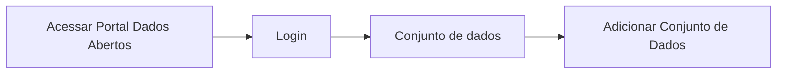

# Criação de novos metadados

**Como** publicador, **eu quero**  criar novos metadados, **para** que eu possa validar os dados em um arquivo(s) de dados Tabulares em relação a sua tabela de forma mais eficaz.

- **Acesso:** 

- **Perfil de acesso:** Publicador. 
- **Protótipo:** Baixa Fidelidade.

- **Regra negocial:** Para que possa criar novos metadados , o sistema deve se comportar conforme as regras abaixo:
	- **RN001:** Para que seja feita a criação de novos metadados do dicionário de dados (Table Schema), o(s) arquivo(s) de dados deve ser em formato tabular.
	- **RN002** - Ao carregar um arquivo(s) de dados `Não` tabular, o sistema deverá habilitar apenas os dados do recurso para a criação de novos metadados.
	- **RN003** - Para a criação de um novo metadado do dicionário de dados, o tipo de dado irá impactar na escolha de novos metadados.
	- **RN004** - Para a criação de de um novo metadado do dicionário de dados, do tipo `Lista` o sistema irá se comportar da seguinte maneira:
		   - Deverá ser criado, ao lado do nome do campo um campo do tipo texto,
	       - O intervalo deverá ser separado por `(,)`. Ex.: Janeiro, Fevereiro, Março, etc.
	       - Este campo será alfanumérico,
	       - Este campo será de preenchimento obrigatório.
    - **RN005** - Para a criação de de um novo metadado do dicionário de dados, do tipo `Max e Min` o sistema irá se comportar da seguinte maneira: 
	       - Deverá ser criado, ao lado do nome do campo 2 campos texto ( um para o valor mínimo e outro para o valor máximo). 
	       - Este campo será numérico.
	       - Este campo será de preenchimento obrigatório.
	- **RN006** - Para a criação de de um novo metadado do dicionário de dados, do tipo `Tamanho Maximo e Mínimo` o sistema irá se comportar da seguinte maneira: 
	       - Deverá ser criado, ao lado do nome do campo 2 campos texto ( Quantidade de caracteres mínimo e  máximo). 
	       - Este campo será alfanumérico.
	       - Este campo será de preenchimento obrigatório.
	- **RN007** - Para a criação de de um novo metadado do  dicionário de dados, do tipo `Lista de Valores` o sistema irá se comportar da seguinte maneira: 
	       - Deverá ser criado, ao lado do nome do campo um campo do tipo texto,
	       - O intervalo deverá ser separado por `(,)`. Ex.: *Fluência em Idiomas:* Português, Inglês, Espanhol, etc.
	       - Este campo será alfanumérico,
	       - Este campo será de preenchimento obrigatório.
	- 
 
### Critérios de aceite

- **Critério 001 – Editar Metadados de arquivos tabulares do dicionário de dados :**
	- **Dado**  eu quero fazer a edição dos metadados do dicionário de dados e os dados do recurso 
	- **Quando** o sistema fizer as devidas inferências.
	- **Então** escolho a opção que desejo editar e faço a edição.

- **Critério 002** – Editar Metadados de arquivos `Não` tabulares dos dados do recurso:
	- **Dado** que quero fazer a edição dos metadados dos dados do recurso.
	- **Quando** o sistema apresentar as informações inferidas deste campo.
	- **Então** escolho a opção que desejo editar e faço a edição.

- **Critério 003** – Editar o campo `Restrições` de arquivos tabulares do dicionário de dados:
	- **Dado** que quero fazer a edição dos metadados do campo `Restrições` do dicionário de dados.
	- **E** o sistema apresenta a informação padrão deste campo.
	- **Quando** escolho a opção `Enum`.
	- **Então** o sistema exibe o campo texto abaixo da opção para inserir as informações. 

- **Critério 004** – Editar o campo `Restrições` de arquivos tabulares do dicionário de dados:
	- **Dado** que quero fazer a edição dos metadados do campo `Restrições` do dicionário de dados.
	- **E** o sistema apresenta a informação padrão deste campo.
	- **Quando** escolho a opção `Max e Min`.
	- **Então** o sistema exibe o campo texto abaixo da opção para inserir as informações. 

### Prototipação

[Link para prototipacao]()

| Item |                        Nome do Campo                        | Tipo de Dado | Opções/Domínio |     Descrição/Observações      |
|------|-------------------------------------------------------------|------------------|----------------|--------------------------------|
|    1 | Título                 | O, E, CT              | N/A        | Campo título com quantidade de caracteres máximo de 100            |
|    2 | Descrição              | O, E, CT              | N/A            | Campo título com quantidade de caracteres máximo de 3000      |
|    3 | Tipo de dados | CB             | N/A            | Usuário poderá escolher qualquer informação dentre as que se apresentem na Combobox. |
|    4 | Formato de dados  | CB              | N/A            | Usuário poderá escolher qualquer informação dentre as que se apresentem na Combobox. |
|    5 | Restrições                         | CB                | N/A            | Usuário poderá escolher qualquer informação dentre as que se apresentem na Combobox.|
|    6 | Enum  | O, CT              | N/A            | Ao escolher a opção `Enum` o usuário deverá informar um conjunto fixo de valores, sendo eles Texto ou Números. |	
|    7 | Max e Min  | O, CT              | N/A            | Ao escolher a opção `Max e Min` o usuário deverá informar um intervalo de valores. |