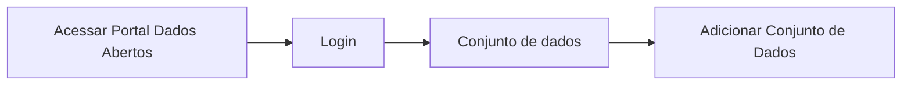

# Validação do conjunto de dados

**Como** Publicador, **eu quero**  obter o resultado da validação das informações do(s) arquivo(s) de dados  **para** que eu possa publicar o Conjunto de Dados no Portal. 

- **Acesso:** 



- **Perfil de acesso:** Publicador. 
- **Protótipo:** Baixa Fidelidade.

- **Regra negocial:** Para que possa validar todos os metadados do(s) arquivo(s) de dados , o sistema deve se comportar conforme as regras abaixo:
	- **RN001** - Todos os campos, inferidos ou não, serão validados de acordo com as especificações da Frictionless[^1]
	- **RN002** - O resultado positivo da validação de qualquer propriedade não é condição para o usuário prosseguir para a próxima etapa do fluxo.
	- **RN003** - o resultado da validação fica referenciável por hiperlink em uma badge de validação e armazenado em página estática de acordo com framework da Fricitonless,
	- **RN004** - Os relatórios de validação deverão ser armazenados no ckan/portal de dados.  
    - **RN005** - A lista com os relatorios de validação deverá ser visualizada na aba do fluxo de atividades.
	- **RN006** - Não haverá limite de tempo para armazenamento da página estática de resultado do relatório de validação dos metadados. 

- **Critério 001 – Validar Campos**
	- **Dado** realizo todas as possiveis alterações
	- **Quando** aciono o botão validar 
	- **Então** o sistema deverá fazer a validação dos campos. 
```
Regra Negocial DTA - Campos: Título, Descrição são de preenchimento obrigatórios. 
Obrigatórios.
```
- **Critério 002 – Título e Descrição: Campos de preenchimento obrigatórios**
	- **Dado** que não realizo o preenchimento dos campos: Título e/ou Descrição
	- **Quando** o aciono o botão `Validar`
	- **Então** o sistema deve informar que os campos de preenchimento obrigatório não foram preenchidos.


### Prototipação

[Link para prototipacao](https://www.figma.com/proto/X0SZVAiL6Auf6pqssoewnn/SEPLAG-CKAN?node-id=2%3A387&scaling=min-zoom&page-id=2%3A387&starting-point-node-id=217%3A1115)


| Item |                        Nome do Campo                        | Tipo de Dado[^2] | Opções/Domínio |     Descrição/Observações      |
|------|-------------------------------------------------------------|------------------|----------------|--------------------------------|
|    1 |  Validar     | B,O             |  N/A       | Validar todos os campos da aba de Adicionar Dados.
|    2 |   Próximo            |   LK            |      N/A      | Após validação dos campos, fica habilitado para avançar para a próxima aba (Conjunto de Dados) |
|    3 | Cancelar |     LK         |       N/A      | Cancela as informações em tela. |
|    4 | Salvar  |     B          |       N/A      | Salva as informações sem precisar validar. Estende-se para a estória: [US008  -Salvar dados do recurso](/estorias_de_usuarios/08_salvar_dados_do_recurso) |

[^1]: [Frictionless](https://specs.frictionlessdata.io/#overview)
[^2]: [Tipos de dados](../modelos/tipos_dado_formulario_html.md)