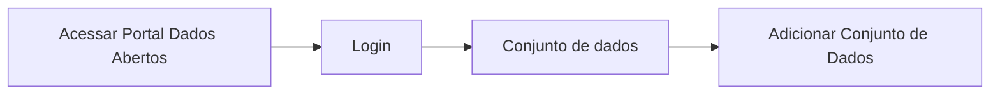

# Validação de dados do conjunto do recurso

**Como** publicador, **eu quero**  Validar as informações do(s) arquivo(s) de dados  **para** que eu possa preencher os dados do conjunto do recurso. 

- **Acesso:** 

- **Perfil de acesso:** Publicador. 
- **Protótipo:** Baixa Fidelidade.

- **Regra negocial:** Para que possa validar todos os metadados do(s) arquivo(s) de dados , o sistema deve se comportar conforme as regras abaixo:
	- **RN001** -
	- **RN002** - 
	- **RN003** - 
	- **RN004** - 
    - **RN005** - 
	- **RN006** - 
	- **RN007** - 	- 
 
### Critérios de aceite

- **Critério 001 – **
	- **Dado**  
	- **Quando** 
	- **Então** 

### Prototipo Baixa Fidelidade

[Link para prototipacao](/assets/pdfs/prototipo_telas_ckan.pdf)

### Prototipo Alta Fidelidade

[Link para prototipacao](https://www.figma.com/proto/X0SZVAiL6Auf6pqssoewnn/SEPLAG-CKAN?node-id=2%3A387&scaling=min-zoom&page-id=2%3A387&starting-point-node-id=217%3A1115) 
### Imagens protótipo Baixa Fidelidade

| Item |                        Nome do Campo                        | Tipo de Dado | Opções/Domínio |     Descrição/Observações      |
|------|-------------------------------------------------------------|------------------|----------------|--------------------------------|
|    1 |                  |              |         | 
|    2 |               |               |            | |
|    3 |  |              |             |  |
|    4 |   |               |             |  |
|    5 |                          |                 |            | |
|    6 |   |               |             |  |	
|    7 |   |             |           |  |