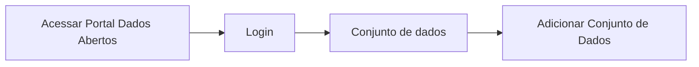

# Validação do conjunto de dados

**Como** publicador, **eu quero**  validar os metadados do conjunto de dados  **para** que eu faça a publicação do mesmo no Portal.

- **Acesso:** 



- **Perfil de acesso:** Publicador. 
- **Protótipo:** Baixa Fidelidade.

- **Regra negocial:** Para que possa validar todos os metadados do conjunto de dados, o sistema deve se comportar conforme as regras abaixo:
- **RN001** - Todos os campos serão validados de acordo com as especificações da Frictionless[^1]
	- **RN002** - O resultado positivo da validação de qualquer propriedade não é condição para o usuário prosseguir para a publicação do Conjunto de dados. 
	- **RN003** - O resultado da validação fica referenciável por hiperlink em uma badge de validação e armazenado em página estática de acordo com framework da Fricitonless. 
	- **RN004** - Os relatórios de validação serão armazenados no ckan/portal de dados.  
    - **RN005** - A lista com os relatorios de validação será visualizada na aba do fluxo de atividades.
	- **RN006** - Não haverá limite de tempo para armazenamento da página estática de resultado do relatório de validação do conjunto de dados.
 
### Critérios de aceite

````
Regra Negocial DTA: Campos Título, Descrição, Licença, Autor e 
Palavras-chave: são de preenchimento obrigatórios.
````

- **Critério 001 – Título, Descrição, Licença, Autor e Palavras-chave: Campos de preenchimento obrigatórios**
	- **Dado** que não preencho alguns dos campos obrigatórios a seguir: Título, Descrição, Licença, Autor e Palavras-chave.
	- **Então** o sistema não deve habilitar o o botão de `Adicionar Dados`. 

- **Critério 002 – Validar Campos**
	- **Dado** que realizo todas as possíveis edições.
	- **E** aciono o botão `Adicionar dados`,
	- **Então** o sistema deverá fazer a validação de todos os campos obrigatórios.

- **Critério 003 – Salvar Dados**
	- **Dado** que realizo todas as possiveis alterações.
	- **E** aciono o botão `Adicionar dados`,
	- **Então** o sistema deverá fazer o salvamento automático dos dados cadastrados[^1]. 

### Prototipo Baixa Fidelidade

[Link para prototipacao](/assets/pdfs/prototipo_telas_ckan.pdf)

### Prototipo Alta Fidelidade

[Link para prototipacao](https://www.figma.com/proto/X0SZVAiL6Auf6pqssoewnn/SEPLAG-CKAN?node-id=2%3A387&scaling=min-zoom&page-id=2%3A387&starting-point-node-id=217%3A1115) 
### Imagens protótipo Baixa Fidelidade


| Item |                        Nome do Campo                        | Tipo de Dado[^3] | Opções/Domínio |     Descrição/Observações      |
|------|-------------------------------------------------------------|------------------|----------------|--------------------------------|
|    1 |    Título               |    O, CT          |     N/A    | Campo título sem limitação de quantidade de caracteres.
|    2 |           Descrição    |    O, CT           |       N/A     |Campo descrição sem limitação de quantidade de caracteres |
|    3 |  Organização|      O, CB         |       N/A     | Seleção da organização na qual o usuário logado faz parte. |
|    4 |   Visibilidade |        CB        |   N/A          | Seleção do tipo de visibilidade: Privada ou Pública  |
|    5 |   Tipo                       |  CB               |    N/A        |Selecionar o tipo de arquivo: Tabular ou não tabular. |
|    6 |  Versão |         CT      |        N/A       |  Campo para informar a versão do documento.|	
|    7 |  Contribuidores |       CB      |       N/A     | Seleção do tipo de contribuidor|
|    8 |  (+) |       B      |      N/A     | Botão para adicionar mais um contribuidor  |
|    9 |  Publicador |   O, CT          |    N/A       | Campo que informa o nome do Publicador do Conjunto |
|    10 |  E-mail |        O, CT     |   N/A        | Campo que informa o e-mail do Publicador do Conjunto |
|    11 |  URL |        CT     |    N/A      | Campo que informa a URL do Publicador do Conjunto.
|    12 |  Autor |       O, CT      |   N/A       |  Campo que informa o nome do Autor do Conjunto|
|    13 | E-mail  |      O, CT       |    N/A       | Campo que informa o e-mail do Autor do Conjunto |
|    14 | URL  |      CT       |         N/A  | Campo que informa a URL do Autor do Conjunto |
|    15 | Frequência de Atualização  |   CB          |      N/A     | Seleção da frequência em que o Conjunto será atualizado.  |
|    16 | Outras Propriedades  |  B           |     N/A      | Botão para Adionar outras propriedades extras  |
|    17 | Propriedade  |    CT         |  N/A         | Campo para descrever o nome da propriedade  |
|    18 | Valor |         CT    |          N/A | Campo para descrever o valor da propriedade  |
|    19 | Palavras-Chave |    CT         |   N/A        | Campo para informar as palavras-chave que compõe aquele determinado conjunto, sendo separado por vírgula.  |
|    20 | Grupos  |         CT    |     N/A      | Campo para informar grupos que compõe aquele determinado conjunto. O campo será auto completado.[^1]|

[^1]:Ao salvar os dados e não publicá-los o mesmo ficará com o status de rascunho e poderá ser acessado na lista de conjuntos do usuário. 
[^2]::[gitnore](https://www.toptal.com/developers/gitignore/)
[^3]: [Tipos de dados](../modelos/tipos_dado_formulario_html.md)