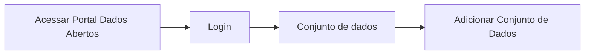

# Publicação do Conjunto de dados

**Como** publicador, **eu quero**  publicar meu conjunto de dados  **para** que seja feita a divulgação das informações do mesmo no Portal. 

- **Acesso:** 

- **Perfil de acesso:** Publicador. 
- **Protótipo:** Baixa Fidelidade.

- **Regra negocial:** Para que possa publicar o conjunto de dados, o sistema deve se comportar conforme as regras abaixo:
	- **RN001** - Para que haja a publicação do conjunto de dados é necessário que seja feita a validação de todo o conjunto. 
	- **RN002** - O resultado positivo da validação de qualquer propriedade não é condição para o usuário prosseguir para a publicação do Conjunto de dados. 
	- **RN003** - O sistema deverá solicitar a confirmação da publicação nos casos de resultado negativo da validação. 
	- **RN004** - Para habilitar o botão de `Publicar Conjunto de Dados` deverá, ao menos uma vez, acionar o botão de validação. 
	- **RN005** - Ao acionar o botão de `Publicar Conjunto de Dados` o sistema deverá redirecionar o usuário para a tela do novo conjunto publicado. 
    - **RN006** - Após acionar o botão de `Publicar Conjunto de Dados` o sistema deverá: 
    	- Mergear os metadados do CKAN com os da Frictionless. 
		- Aprimorar página de metadados dos arquivo(s) de dados. (ir para a pagina aprimorar pagina do recurso)
		- Gerar imagem da entidade de relacionamento, com hiperlink sob cada tabela / entidade, que estará contida dentro de uma aba do conjunto publicado. 
		- Gerar a URL do conjunto possibilitando a leitura do mesmo via ferramentas de desenvolvimento.[^1]
 
### Critérios de aceite

- **Critério 001 – **
	- **Dado**  
	- **Quando** 
	- **Então** 

### Prototipação

[Link para prototipacao](https://www.figma.com/proto/X0SZVAiL6Auf6pqssoewnn/SEPLAG-CKAN?node-id=2%3A387&scaling=min-zoom&page-id=2%3A387&starting-point-node-id=217%3A1115)

| Item |                        Nome do Campo                        | Tipo de Dado | Opções/Domínio |     Descrição/Observações      |
|------|-------------------------------------------------------------|------------------|----------------|--------------------------------|
|    1 |                  |              |         | 
|    2 |               |               |            | |
|    3 |  |              |             |  |
|    4 |   |               |             |  |
|    5 |                          |                 |            | |
|    6 |   |               |             |  |
|    7 |   |             |           |  |

[^1]: [Proposta de implementação desta funcionalidade via Frictionless](https://github.com/frictionlessdata/framework/issues/475)