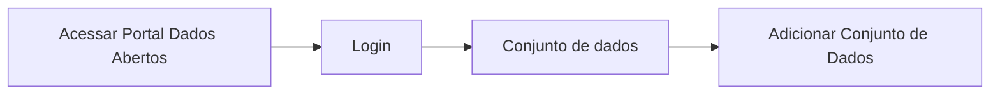

# Publicação do Conjunto de dados

**Como** publicador, **eu quero**  publicar meu conjunto de dados  **para** que seja feita a divulgação das informações do mesmo no Portal. 

- **Acesso:** 

- **Perfil de acesso:** Publicador. 
- **Protótipo:** Baixa Fidelidade.

- **Regra negocial:** Para que possa publicar o conjunto de dados, o sistema deve se comportar conforme as regras abaixo:
	- **RN001** - Para que haja a publicação do conjunto de dados é necessário que seja feita a validação de todo o conjunto. 
	- **RN002** - O resultado positivo da validação de qualquer propriedade não é condição para o usuário prosseguir para a publicação do Conjunto de dados. 
	- **RN003** - O sistema deverá solicitar a confirmação da publicação nos casos de resultado negativo da validação. 
	- **RN004** - Para habilitar o botão de `Publicar Conjunto de Dados` deverá, ao menos uma vez, acionar o botão de validação. 
	- **RN005** - Ao acionar o botão de `Publicar Conjunto de Dados` o sistema deverá redirecionar o usuário para a tela do novo conjunto publicado. 
    - **RN006** - Após acionar o botão de `Publicar Conjunto de Dados` o sistema deverá: 
    	- Mergear os metadados do CKAN com os da Frictionless. 
		- Aprimorar página de metadados dos arquivo(s) de dados. (ir para a pagina aprimorar pagina do recurso)
		- Gerar imagem da entidade de relacionamento, com hiperlink sob cada tabela / entidade, que estará contida dentro de uma aba do conjunto publicado. 
		- Gerar a URL do conjunto possibilitando a leitura do mesmo via ferramentas de desenvolvimento.[^1]
 
### Critérios de aceite

- **Critério 001 –** Botão Publicar desabilitado
	- **Dado**  que não fiz nenhuma validação dos metadados dos recursos
	- **E** desejo fazer a publicação do Conjunto
	- **Então** o sistema mantém o botão de `Publicar Conjunto de Dados` desabilitado.

- **Critério 002 –** Botão Publicar Habilitado
	- **Dado**  que fiz, ao menos, uma validação dos metadados dos recursos
	- **E** desejo fazer a publicação do Conjunto
	- **Então** o sistema habilita o botão de `Publicar Conjunto de Dados`.

- **Critério 003 –** Publicar Conjunto de Dados com validação positiva
	- **Dado**  que fiz, ao menos, uma validação dos metadados dos recursos
	- **E** o resultado da validação for positivo. 
	- **Quando** aciono o botão `Publicar Conjunto de Dados`
	- **Então** o sistema publica o conjunto e redireciona para a página do conjunto publicada.	

- **Critério 004 –** Publicar Conjunto de Dados com validação negativa
	- **Dado**  que fiz, ao menos, uma validação dos metadados dos recursos
	- **E** o resultado da validação for negativo. 
	- **Quando** aciono o botão `Publicar Conjunto de Dados`
	- **Então** o sistema solicita a confirmação da publicação e 
		- Em caso positivo: Publica o conjunto e redireciona para a página do conjunto publicada
		- Em caso negativo: Permanece na página para nova validação. 	

### Prototipação

[Link para prototipacao](https://www.figma.com/proto/X0SZVAiL6Auf6pqssoewnn/SEPLAG-CKAN?node-id=2%3A387&scaling=min-zoom&page-id=2%3A387&starting-point-node-id=217%3A1115)

| Item |                        Nome do Campo                        | Tipo de Dado[^1] | Opções/Domínio |     Descrição/Observações      |
|------|-------------------------------------------------------------|------------------|----------------|--------------------------------|
|    1 | Dic. Dados:	Nome do Recurso        | O, CT              | N/A            | Descrição manual do nome do Recurso.|
|    2 | Dic. Dados:Título                 | CT              | N/A            | Campo texto para o título do recurso com tamanho máximo de 100 caracteres       |
|    3 | Dic. Dados:Descrição | CT         | N/A            |Campo texto para a descrição do recurso com tamanho máximo de 5000 caracteres |
|    4 | Dic. Dados:Tipo de Dado  | CB              | N/A            | Seleção automática do tipo possível de dados como: texto, número, etc. |
|    5 | Dic. Dados:Formato de dado       | CB                | N/A            | Seleção automática com os formatos de dados predeterminados, como: padrão, e-mail, etc.|
|    6 | Dic. Dados:Obrigatório    | CB                | N/A            | Por padrão, a opção `NÃO` deverá estar selecionada. Estende-se para estória: [US003 - Editar Metadados](/estorias_de_usuarios/03_edicao_dos_dados_do_recurso) |
|    7 | Dic. Dados:Único       | CB                | N/A            | Por padrão, a opção `NÃO` deverá estar selecionada. Estende-se para estória: [US003 - Editar Metadados](/estorias_de_usuarios/03_edicao_dos_dados_do_recurso)                        | B                | N/A            | Adiciona novo arquivo(s) de dados          |
|    8 |Dic. Dados:(+) Adicionar Metadados   | B                | N/A            | Escolha de metadados complementares. [US003 - Editar Metadados](/estorias_de_usuarios/03_edicao_dos_dados_do_recurso)       |
|    09 | Dic. Dados:Salvar   | B                | N/A            | Ao acionar o botão <<Salvar>> o sistema salva as alterações feitas. Estende-se para estória: [US003 - Editar Metadados](/estorias_de_usuarios/03_edicao_dos_dados_do_recurso)  |
|    10 | Dados do Recurso: Tipo de formato      | CB                | N/A            | Seleção automática do tipo de extensão: Tabular ou não tabular |
|   11 |Dados do Recurso: Formato do recurso  | CB       | N/A            | Seleção automática do formato do recurso, como: xls, csv, etc.     |
|   12 | Dados do Recurso: Codificação   | CB                | N/A            | Descrição manual do tipo de codificação, como UTF-8, etc |

[^1]: [Proposta de implementação desta funcionalidade via Frictionless](https://github.com/frictionlessdata/framework/issues/475)
[^2]: [Tipos de dados](../modelos/tipos_dado_formulario_html.md)