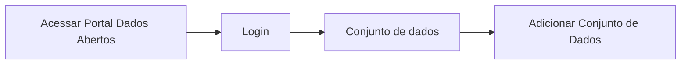

# Aprimorar Página do Recurso

**Como** um usuário externo, **eu quero** analisar os dados de cada recurso publicado **para** que eu possa compreender e usar melhor dados.

- **Acesso:** 

- **Perfil de acesso:** Usuário Externo.
- **Protótipo:** Baixa Fidelidade.

- **Regra negocial:** Para que possa aprimorar a página do(s) arquivo(s) de dados , o sistema deve se comportar conforme as regras abaixo:
	- **RN001** - É necessário que a tabela que contém o dicionário de dados seja mais completa para que haja um maior entendimento sobre cada dado. Conforme Exemplo abaixo[^1]
	- **RN002** - É necessário que a tabela que contém as informações adicionais seja mais completa para que haja um maior entendimento sobre cada dado.
	- **RN003** - A barra de navegação lateral deve estar no topo, à esquerda, da área de conteúdo da página.  

### Critérios de aceite

- **Critério 001 –** Visualizar Informações na tela de arquivo(s) de dados
	- **Dado**  que estou na tela do recurso
	- **E** quero ter um melhor entendimento do recurso
	- **Então** o sistema apresenta o Dicionário de dados com informações mais completas para que possa fazer melhor a análise dos dados. 

- **Critério 002 –** Visualizar Informações na tela de arquivo(s) de dados
	- **Dado**  que estou na tela do recurso
	- **E** quero ter um melhor entendimento de todas as informações. 
	- **Então** o sistema apresenta no campo de Informações adicionais todos os dados essenciais para que ter uma melhor análise dos dados. 

### Prototipação

[Link para prototipacao](https://www.figma.com/proto/X0SZVAiL6Auf6pqssoewnn/SEPLAG-CKAN?node-id=2%3A387&scaling=min-zoom&page-id=2%3A387&starting-point-node-id=217%3A1115)

| Item |                        Nome do Campo                        | Tipo de Dado[^2] | Opções/Domínio |     Descrição/Observações      |
|------|-------------------------------------------------------------|------------------|----------------|--------------------------------|
|    1 |                  |              |         | 
|    2 |               |               |            | |
|    3 |  |              |             |  |
|    4 |   |               |             |  |
|    5 |                          |                 |            | |
|    6 |   |               |             |  |	
|    7 |   |             |           |  |

[^1]: [Exemplo para a tabela de dicionário de dados](https://www.getdbt.com/mrr-playbook/#!/model/model.acme.customer_churn_month)
[^2]: [Tipos de dados](../modelos/tipos_dado_formulario_html.md)
