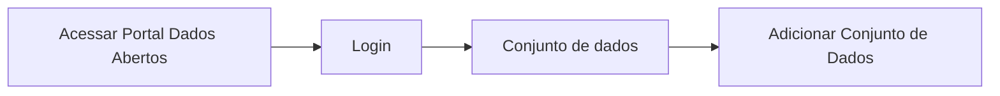

# Aprimorar Página do Conjunto

**Como** um usuário externo, **eu quero** analisar os dados do conjunto publicado **para** que eu possa compreender e usar melhor dados do conjunto.

- **Acesso:** 

- **Perfil de acesso:** usuário externo
- **Protótipo:** Baixa Fidelidade.

- **Regra negocial:** Para que seja feita o aprimoramento da página do conjunto, o portal deve se comportar conforme as regras abaixo:
       - **RN001** - É necessário que a tabela que contém as informações adicionais seja mais completa para que haja um maior entendimento sobre cada dado.
	   - **RN002:** - Será criada mais uma aba no conjunto para que seja inserida a imagem de entidade de relacionamento.
	   - **RN003:** - Após a validação das informações, o link com o resultado da validação, será informada dentro da aba de Fluxo de atividades.
          - **RN004:** - Cada alteração do conjunto terá um hiperlink com o relatório do resultado da validação. 
 	   - **RN005:** - Dentro da lista de recurso o datapackage.json não será mais apresentado na lista. 
	   - **RN006:** - Será criado uma coluna com checkbox ao lado de cada recurso do conjunto para que seja selecionado mais de um recurso para baixar. 

### Critérios de aceite

- **Critério 001 –** Página do Conjunto
       - **Dado** que estou na tela de conjunto
       - **Quando** desejo visualizar as informações sobre o conjunto
       - **Então** o sistema apresenta nas Informações Adicionais com todos os dados necessarios para entendimento.

- **Critério 002 –** Aba Entidade de Relacionamento
	   - **Dado** que estou na tela de conjunto
	   - **E** desejo visualizar a entidade de relacionamento
	   - **Quando** - seleciono a aba de entidade de relacionamento
	   - **Então** o sistema apresenta a tela de Entidade de relacinamento[^1].

- **Critério 003 –** Checkbox para selecionar recursos
	   - **Dado** que estou na tela de conjunto
	   - **Quando** seleciono mais de um recurso
	   - **Então** o sistema habilita a opção de baixar todos os recursos selecionados.

### Prototipo Baixa Fidelidade

[Link para prototipacao de baixa fidelidade](link_para_prototipo_baixa_fidelidade)

### Prototipo Alta Fidelidade

[Link para prototipacao de alta fidelidade](link_para_prototipo_alta_fidelidade) 
### Imagens protótipo Baixa Fidelidade

| Item |                        Nome do Campo                        | Tipo de Dado[^2] | Opções/Domínio |     Descrição/Observações      |
|------|-------------------------------------------------------------|------------------|----------------|--------------------------------|
|    1 |           |            |              |                    |
|    2 |           |            |              |                    |                
|    3 |           |            |              |                    |
|    4 |           |            |              |                    |
|    5 |           |            |              |                    |
|    6 |           |            |              |                    |

[^1]: [Estoria será criada na Sprint06](www.dados.mg.gov.br)
[^2]: [Tipos de dados](../modelos/tipos_dado_formulario_html.md)