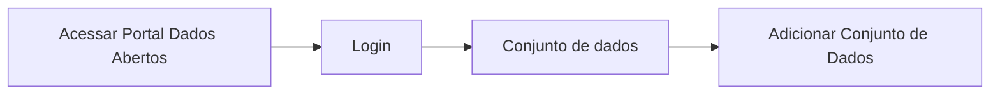

# Gerar imagem da entidade de relacionamento

**Como** publicador, **eu quero** gerar uma imagem de entidade de relacionamento **para** facilitar o entendimento das relações entre os recursos do conjunto.

- **Acesso:** 

- **Perfil de acesso:** publicador
- **Protótipo:** Baixa Fidelidade.

- **Regra negocial:** Para que seja gerada a entidade de relacionamento da página do conjunto, o portal deve se comportar conforme as regras abaixo:
       - **RN001:** - O diagrama só será gerado quando houver um relacionamento entre os recursos. 
	- **RN002:** - A relação entre os recursos, quando existir, deverá estar expressa no Dicionário de Dados
	- **RN003:** - Deverá ser adicionada no Dicionário de Dados, em adicionar novos metadados, a chave primária[^1]/ chave Estrangeira Foreign key[^2]. 
       - **RN004:** - 
 	- **RN005:** - 
	- **RN006:** - 

### Critérios de aceite

- **Critério 001 –** 
       - **Dado** 
       - **Quando** 
       - **Então** 

- **Critério 002 –** 
	   - **Dado** 
	   - **E** 
	   - **Quando** - 
	   - **Então** 

- **Critério 003 –** 
	   - **Dado** 
	   - **Quando** 
	   - **Então** 

### Prototipo Baixa Fidelidade

[Link para prototipacao de baixa fidelidade](link_para_prototipo_baixa_fidelidade)

### Prototipo Alta Fidelidade

[Link para prototipacao de alta fidelidade](link_para_prototipo_alta_fidelidade) 
### Imagens protótipo Baixa Fidelidade

| Item |                        Nome do Campo                        | Tipo de Dado[^3] | Opções/Domínio |     Descrição/Observações      |
|------|-------------------------------------------------------------|------------------|----------------|--------------------------------|
|    1 |           |            |              |                    |
|    2 |           |            |              |                    |                
|    3 |           |            |              |                    |
|    4 |           |            |              |                    |
|    5 |           |            |              |                    |
|    6 |           |            |              |                    |

[^1]: [Chave Primária](https://specs.frictionlessdata.io/table-schema/#primary-key)
[^2]: [Chave Estrangeira] (https://specs.frictionlessdata.io/table-schema/#foreign-keys)
[^3]: [Tipos de dados](../modelos/tipos_dado_formulario_html.md)