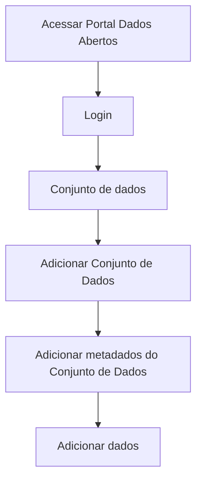

# Upload de arquivo(s) de dados

**Como** publicador, **eu quero** fazer upload de um ou mais arquivo(s) de dados no portal, **para** documentar os metadados do(s) mesmo(s) no padrão [Frictionless Data](https://specs.frictionlessdata.io/#testes-realizados-pela-stefanini-em-ambiente-prorpio).

- **Acesso:** 

- **Perfil de acesso:** Publicador. 

- **Testes:** [Resultados Finais Obtidos](../../../testes/sprint_02/01_upload_de_arquivos_recursos_casos_de_teste/#testes-realizados-pela-equipe-dcta-em-ambiente-da-cge).

- **Status:** Finalizado. 

## Critérios de aceite
Para que seja feito o upload de arquivo(s) de dados, o portal deve se comportar conforme as critérios de aceite abaixo:

### **Critério 001 – Adicionar arquivo(s) de dados:**
- **Dado** que estou na tela de `Adicionar arquivo(s) de dados`.
- **Quando** o botão `carregar` for acionado.
- **Então** o sistema deverá incluir quantos arquivo(s) de dados sejam necessários.

#### **Regra negocial 001.001**: 
Ao clicar na opção `Adicionar arquivo(s) de dados` página com opção de upload de arquivo(s) de dados deverá ser carregada. A exibição dos metadados em tela deverá estar desabilitada. Opção de adicionar novo arquivo(s) de dados deverá existir na tela.

#### **Regra negocial 001.002**:
Caso não tenha sido carregado nenhum arquivo(s) de dados e aciono a opção `Expandir a exibição dos metadados` o sistema deverá habilitar o campo em branco.

#### **Regra negocial 001.003**:
Ao clicar na opção `Escolher arquivo` o sistema operacional deverá abrir a tela de busca para seleção do arquivo(s) de dados que desejo carregar.

#### **Regra negocial 001.004**:
Ao clicar na opção `carregar`, caso tenha selecionado um arquivo para upload de tamanho muito grande o sistema deverá informar uma mensagem de erro.

#### **Regra negocial 001.005**: 
Ao clicar na opção `carregar`, após selecionar o carregamento do arquivo(s) de dados na tela de busca do sistema operacional, o sistema deverá carregar os metadados do(s) arquivo(s) de dados selecionado em tela.

#### **Regra negocial 001.006**:
Ao carregar arquivo(s) de dados do tipo tabular, o sistema deverá habilitar o campo do Dicionário de Dados, com as colunas do arquivo(s) de dados selecionado.  

#### **Regra negocial 001.007**:
Ao carregar arquivo(s) de dados do tipo não tabular, o sistema deverá habilitar o campo do Dicionário de Dados com o ícone da extensão do arquivo.

#### **Regra negocial 001.008**:
Ao adicionar um novo arquivo(s) de dados, a exibição dos metadados do(s) anteriormente carregados deverá(ão) ser desabilitada(s). 

#### **Regra negocial 001.009**:
Ao adicionar mais de um arquivo(s) de dados poderei clicar no ícone (dropdown) que expande e recolher sua visibilidade.

## Prototipação

- [Prototipo baixa fidelidade](/assets/pdfs/prototipo_telas_ckan.pdf)

| Item |                        Nome do Campo                        | Tipo de Dado[^1] | Opções/Domínio |     Descrição/Observações      |
|------|-------------------------------------------------------------|------------------|----------------|--------------------------------|
|    1 | :material-upload: Carregar| B,O| N/A| Carregar arquivo(s) de dados.            |
|    2 | :octicons-trash-24: Lixeira| IM| N/A| Apagar arquivo(s) de dados.       |
|    3 | :fontawesome-solid-circle-chevron-right: Expandir metadados | IM              | N/A            | Expandir metadados do(s) arquivo(s) de dados. |
|    4 | :fontawesome-solid-circle-chevron-down: Recolher metadados  | IM              | N/A            | Recolher metadados do(s) arquivo(s) de dados. |
|    5 | :simple-addthis: Adicionar arquivo(s) de dados  | B  | N/A  | Adiciona novo arquivo(s) de dados.   |
|    6 | :material-content-save: Salvar          | B                  | N/A            | Salva as edições dos metadados do arquivo(s) de dados.   |

- [Prototipo alta fidelidade Figma](https://www.figma.com/proto/X0SZVAiL6Auf6pqssoewnn/SEPLAG-CKAN?node-id=2%3A387&scaling=min-zoom&page-id=2%3A387&starting-point-node-id=217%3A1115) 

[^1]: [Tipos de dados](../../modelos/tipos_dado_formulario_html.md)