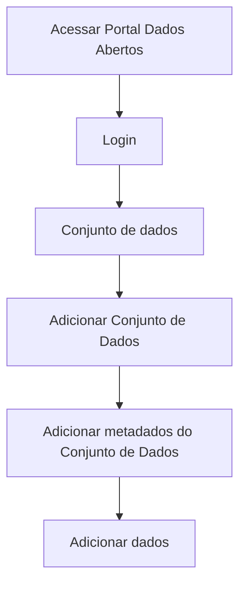

# Inferência de metadados

**Como** publicador, **eu quero**  que o sistema faça a inferência do(s) arquivo(s) de dados carregado(s), **para** me auxiliar na documentação do(s) metadado(s) do(s) mesmo(s).

- **Acesso:** 

- **Perfil de acesso:** Publicador. 

- **Testes:** [Resultados Finais Obtidos](../../../testes/sprint_02/02_inferencia_de_arquivo_casos_de_teste/#testes-realizados-pela-equipe-dcta-em-ambiente-da-cge).

- **Status:** Finalizado.

## Critérios de aceite
Para que seja feito a inferência de arquivo(s) de dados, o portal deve se comportar conforme as critérios de aceite abaixo:

### **Critério 001 – Realizar Inferência dos metadados de arquivo(s) de dados:**
- **Dado** que possuo um recurso tabular ou não.
- **Quando** o botão `carregar` for acionado.
- **Então** o sistema deverá fazer a inferência dos metadados do recurso, inclusive do dicionário de dados para recursos tabulares.

#### **Regra negocial 001.001**: 
O conjuntos de dados e recursos devem seguir o padrão de metadados de acordo com a biblioteca da [Frictionless](https://specs.frictionlessdata.io/#overview).

#### **Regra negocial 001.002**: 
Ao fazer o carregamento de um arquivo(s) de dados que não seja tabular (PDF, Imagem, etc) o sistema deverá apenas fazer a inferência dos dados do recurso e apresentar, em tela, o ícone com nome da extensão.

#### **Regra negocial 001.003**:
Para que seja feita a inferência dos metadados do dicionário de dados, o(s) arquivo(s) de dados deve ser em formato tabular.

#### **Regra negocial 001.004**:
Após o carregamento de arquivo(s) de dados tabular, cada coluna de dados deverá vir na mesma ordem dos campos do o(s) arquivo(s) de dados.

#### **Regra negocial 001.005**:
O campo nome do arquivo(s) de dados deve ser de preenchimento obrigatório e único, conforme [especificação Frictionless](https://specs.frictionlessdata.io/data-resource/#metadata-properties).	

#### **Regra negocial 001.006**:
O nome do recurso deve ser alfanumérico, com letras minúsculas e apenas com `.`, `_`ou `-` para separá-los.

#### **Regra negocial 001.007**:
O nome do recurso, usualmente, deverá corresponder ao nome do arquivo sem a extensão.

#### **Regra negocial 001.008**:
No agrupamento Dicionário de Dados, o campo “Tipo de dados” será inferido pela Frictionless e deverá conter as opções predeterminadas: Texto, Número, Inteiro, Boleano, Objeto, Lista, Data, Hora, Data e Hora, Ano, Ano e Mês, Duração, Geopoint, Geojson, Any. 

#### **Regra negocial 001.009**:
No agrupamento Dicionário de Dados, o campo “Formato de dados” será inferido pela Frictionless e deverá conter as opções predeterminadas na [ especificação Frictionless](https://specs.frictionlessdata.io/#overview): Ex.: Para o tipo de dado String: Padrão, E-mail, Binário, URI, UUID.

#### **Regra negocial 001.0010**:
No agrupamento dos Dados do Recurso deverão ser apresentados os seguintes campos: 
Titulo, Descrição, Formato do recurso, Tipo (Tabular ou não) e Encoding (codificação).

#### **Regra negocial 001.0011**:
No agrupamento dos Dados do Recurso os campos: Formato do recurso, Tipo (Tabular ou não) e Encoding (codificação) serão inferidos pela frictionless e deverão conter as opções predeterminadas pela [mesma](https://specs.frictionlessdata.io/#overview). 
 
## Prototipação

- [Prototipo baixa fidelidade](/assets/pdfs/prototipo_telas_ckan.pdf)

| Item |                        Nome do Campo                        | Tipo de Dado[^1] | Opções/Domínio |     Descrição/Observações      |
|------|-------------------------------------------------------------|------------------|----------------|--------------------------------|
|    1 | Dic. Dados:	Nome do Recurso        | O, CT              | N/A            | Descrição manual do nome do Recurso.|
|    2 | Dic. Dados:Título                 | CT              | N/A            | Campo texto para o título do recurso com tamanho máximo de 100 caracteres       |
|    3 | Dic. Dados:Descrição | CT         | N/A            |Campo texto para a descrição do recurso com tamanho máximo de 5000 caracteres |
|    4 | Dic. Dados:Tipo de Dado  | CB              | N/A            | Seleção automática do tipo possível de dados como: texto, número, etc. |
|    5 | Dic. Dados:Formato de dado       | CB                | N/A            | Seleção automática com os formatos de dados predeterminados, como: padrão, e-mail, etc.|
|    6 | Dic. Dados:Obrigatório    | CB                | N/A            | Por padrão, a opção `NÃO` deverá estar selecionada. Estende-se para estória: [US003 - Editar Metadados](/estorias_de_usuarios/03_edicao_dos_dados_do_recurso) |
|    7 | Dic. Dados:Único       | CB                | N/A            | Por padrão, a opção `NÃO` deverá estar selecionada. Estende-se para estória: [US003 - Editar Metadados](/estorias_de_usuarios/03_edicao_dos_dados_do_recurso)                        | B                | N/A            | Adiciona novo arquivo(s) de dados          |
|    8 |Dic. Dados:(+) Adicionar Metadados   | B                | N/A            | Escolha de metadados complementares. [US003 - Editar Metadados](/estorias_de_usuarios/03_edicao_dos_dados_do_recurso)       |
|    09 | Dic. Dados:Salvar   | B                | N/A            | Ao acionar o botão <<Salvar>> o sistema salva as alterações feitas. Estende-se para estória: [US003 - Editar Metadados](/estorias_de_usuarios/03_edicao_dos_dados_do_recurso)  |
|    10 | Dados do Recurso: Tipo de formato      | CB                | N/A            | Seleção automática do tipo de extensão: Tabular ou não tabular |
|   11 |Dados do Recurso: Formato do recurso  | CB       | N/A            | Seleção automática do formato do recurso, como: xls, csv, etc.     |
|   12 | Dados do Recurso: Codificação   | CB                | N/A            | Descrição manual do tipo de codificação, como UTF-8, etc |

- [Prototipo alta fidelidade Figma](https://www.figma.com/proto/X0SZVAiL6Auf6pqssoewnn/SEPLAG-CKAN?node-id=2%3A387&scaling=min-zoom&page-id=2%3A387&starting-point-node-id=217%3A1115) 

[^1]: [Tipos de dados](../../modelos/tipos_dado_formulario_html.md)