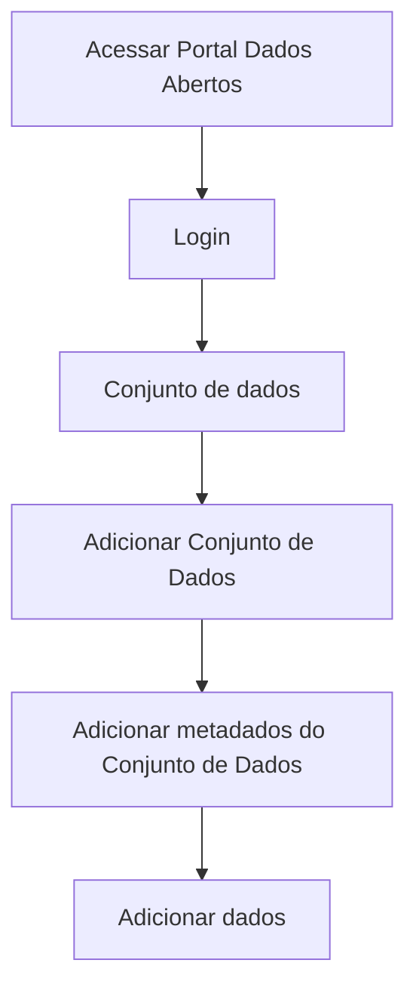

# Criação de novos metadados do recurso

**Como** publicador, **eu quero**  criar novos metadados, **para** que eu possa documentar os metadados de um arquivo(s) de dados de forma mais eficaz.

- **Acesso:** 

- **Perfil de acesso:** Publicador. 

- **Testes:** [Resultados Finais Obtidos](../../../testes/sprint_03/04_criacao_de_novos_metadados_do_recurso_casos_de_teste/#testes-realizados-pela-equipe-dcta-em-ambiente-da-cge).

- **Status:** Finalizado.

## Critérios de aceite
Para que seja feito a edição dos dados de recursos, o portal deve se comportar conforme as critérios de aceite abaixo:

### **Critério 001 – Editar Metadados de arquivo(s) de dados:**
- **Dado** eu quero criar novos metadados dos dados do recurso e dicionário de dados para arquivos tabulares ou não.
- **Quando** o botão `Adicionar Metadados` for acionado.
- **Então** eu escolho qual(is) metadado(s) desejo inserir. 

#### **Regra negocial 001.001**: 
Para que seja feita a criação de novos metadados do Dicionário de Dados, o(s) arquivo(s) de dados deve(m) ser de formato tabular.

#### **Regra negocial 001.002**:
Ao carregar um arquivo(s) de dados não tabular, o sistema deverá habilitar apenas os Dados do Recurso para a criação de novos metadados.

#### **Regra negocial 001.003**:
Para a criação de um novo metadado do Dicionário de Dados, a inferência do tipo de dado irá impactar diretamente na escolha de novos metadados. Exemplo desta regra pode ser obtido nas especificações da propriedade [`required` do table schema frictionless](https://specs.frictionlessdata.io/table-schema/#constraints).

#### **Regra negocial 001.004**:
Para a criação de um novo metadado do Dicionário de Dados, do tipo `Max e Min` o sistema irá se comportar da seguinte maneira: 

- Deverá ser criado, ao lado do nome, dois campos do tipo texto (um para o valor mínimo e outro para o valor máximo). Ex.: *Ano:* Mínimo: 2016 à Máximo: 2022
- Este campo será inteiro.
- Tendo sido adiconado este campo, o mesmo será de preenchimento obrigatório.

#### **Regra negocial 001.005**:
Para a criação de um novo metadado do dicionário de dados, do tipo `Tamanho Maximo e Mínimo` o sistema irá se comportar da seguinte maneira: 

- Deverá ser criado, ao lado do nome, dois campos do tipo texto (Quantidade de caracteres mínimo e  máximo).  Ex.: *CPF:* Mínimo: 11 à Máximo: 14
- Este campo será inteiro.
- Tendo sido adiconado este campo, o mesmo será de preenchimento obrigatório.

#### **Regra negocial 001.006**:
Para a criação de um novo metadado do  dicionário de dados, do tipo `Lista de Valores` o sistema irá se comportar da seguinte maneira: 

- Deverá ser criado, ao lado do nome,  um campo do tipo texto,
- O intervalo deverá ser separado por `(,)`. Ex.: *Fluência em Idiomas:* Português, Inglês, Espanhol, etc.
- Este campo será alfanumérico,
- Tendo sido adiconado este campo, o mesmo será de preenchimento obrigatório.

## Prototipação

- [Prototipo baixa fidelidade](/assets/pdfs/prototipo_telas_ckan.pdf)

| Item |                        Nome do Campo                        | Tipo de Dado[^1] | Opções/Domínio |     Descrição/Observações      |
|------|-------------------------------------------------------------|------------------|----------------|--------------------------------|
|    1 | Título                 | O, E, CT              | N/A        | Campo título com quantidade de caracteres máximo de 100            |
|    2 | Descrição              | O, E, CT              | N/A            | Campo título com quantidade de caracteres máximo de 3000      |
|    3 | Tipo de dados | CB             | N/A            | Usuário poderá escolher qualquer informação dentre as que se apresentem na Combobox. |
|    4 | Formato de dados  | CB              | N/A            | Usuário poderá escolher qualquer informação dentre as que se apresentem na Combobox. |
|    5 | Restrições                         | CB                | N/A            | Usuário poderá escolher qualquer informação dentre as que se apresentem na Combobox.|
|    6 | Enum  | O, CT              | N/A            | Ao escolher a opção `Enum` o usuário deverá informar um conjunto fixo de valores, sendo eles Texto ou Números. |	
|    7 | Max e Min  | O, CT              | N/A            | Ao escolher a opção `Max e Min` o usuário deverá informar um intervalo de valores. |
|    8 |  Validar     | B,O             |  N/A       | Validar todos os campos da aba de Adicionar Dados. Estende-se para a estória: [US005  -Validação de Dados do Recurso](/estorias_de_usuarios/05_validacao_de_dados_do_recurso)
|    9 |   Próximo            |   LK            |      N/A      | Após validação dos campos, fica habilitado o avanço para a próxima aba (Conjunto de Dados). Estende-se para a estória: [US008  -Edição de Dados do Conjunto](/estorias_de_usuarios/06_edicao_de_dados_do_conjunto_do_recurso) |
|    10| Cancelar |     LK         |       N/A      | Cancela as informações em tela. |
|   11 | Salvar  |     B          |       N/A      | Salva as informações sem precisar validar. Estende-se para a estória: [US008  -Salvar dados do recurso](/estorias_de_usuarios/08_salvar_dados_do_recurso) |

- [Prototipo alta fidelidade Figma](https://www.figma.com/proto/X0SZVAiL6Auf6pqssoewnn/SEPLAG-CKAN?node-id=2%3A387&scaling=min-zoom&page-id=2%3A387&starting-point-node-id=217%3A1115) 

[^1]: [Tipos de dados](../../modelos/tipos_dado_formulario_html.md)