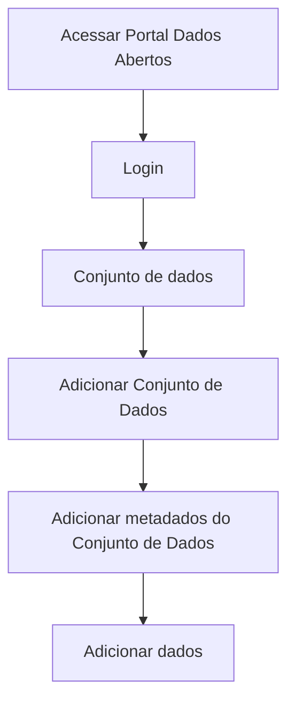

# Validação de dados do recurso

**Como** Publicador, **eu quero**  obter o resultado da validação das informações do(s) arquivo(s) de dados  **para** que sistema me auxilie na identificação de inconsistências antes de publicar o Conjunto de Dados no Portal. 

- **Acesso:** 

- **Perfil de acesso:** Publicador. 

- **Testes:** [Resultados Finais Obtidos](../../../testes/sprint_03/05_validacao_de_dados_do_recurso_casos_de_teste/#testes-realizados-pela-equipe-dcta-em-ambiente-da-cge).

- **Status:** Finalizado.

## Critérios de aceite
Para que seja feito a edição dos dados de recursos, o portal deve se comportar conforme as critérios de aceite abaixo:

### **Critério 001 – Validar Metadados de arquivo(s) de dados:**
- **Dado** eu quero idenficar inconsistências antes de publicar informações no Portal.
- **Quando** o botão `Salvar`, `Validar` ou `Adicionar arquivo(s) de dados` for acionado.
- **Então** os metadados do recurso documentado deverá ser validado frente seu respectivo dado. 

#### **Regra negocial 001.001**: 
Todos os campos, inferidos ou não, serão validados de acordo com as especificações da da [Frictionless](https://specs.frictionlessdata.io/#overview).

#### **Regra negocial 001.002**:
O resultado positivo da validação de qualquer propriedade não é condição para o usuário prosseguir para a próxima etapa do fluxo.

#### **Regra negocial 001.003**:
O resultado da validação fica referenciável por hiperlink em uma badge de validação e armazenado em página estática de acordo com [framework da Fricitonless](https://repository.frictionlessdata.io/docs/reports.html).

#### **Regra negocial 001.004**:
Os relatórios de validação deverão ser armazenados no ckan/portal de dados.  

#### **Regra negocial 001.005**:
Não haverá limite de tempo para armazenamento da página estática de resultado do relatório de validação dos metadados. 

#### **Regra negocial 001.006**
Além da validação frictionless o sistema deverá validar campos cujo o preenchimento seja obrigatório segundo arquivo de configuração utilizado durante instalação da extensão.

> Regra Negocial DTA a ser incluída apenas em arquivo de configuração durante instalação da extensão:

> - Campos: Título e Descrição são obrigatórios e editáveis. 

> - Campos: Tipo, Formato e Encoding dos Dados do Recurso são obrigatórios e não são editáveis. 

> - Campos: Título e Descrição do dicionário de dados são obrigatórios

## Prototipação

- [Prototipo baixa fidelidade](/assets/pdfs/prototipo_telas_ckan.pdf)

| Item |                        Nome do Campo                        | Tipo de Dado[^1] | Opções/Domínio |     Descrição/Observações      |
|------|-------------------------------------------------------------|------------------|----------------|--------------------------------|
|    1 |  Validar     | B,O             |  N/A       | Validar todos os campos da aba de Adicionar Dados.
|    2 |   Próximo            |   LK            |      N/A      | Após validação dos campos, fica habilitado para avançar para a próxima aba (Conjunto de Dados) |
|    3 | Cancelar |     LK         |       N/A      | Cancela as informações em tela. |
|    4 | Salvar  |     B          |       N/A      | Salva as informações sem precisar validar. Estende-se para a estória: [US008  -Salvar dados do recurso](/estorias_de_usuarios/08_salvar_dados_do_recurso) |

- [Prototipo alta fidelidade Figma](https://www.figma.com/proto/X0SZVAiL6Auf6pqssoewnn/SEPLAG-CKAN?node-id=2%3A387&scaling=min-zoom&page-id=2%3A387&starting-point-node-id=217%3A1115) 

[^1]: [Tipos de dados](../../modelos/tipos_dado_formulario_html.md)