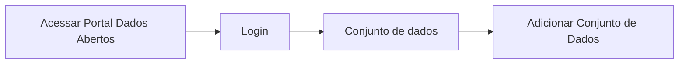
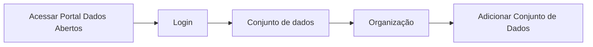

# Edição do Conjunto de Dados

**Como** publicador, **eu quero**  editar os metadados do conjunto de dados **para** que eu possa melhor documentar o mesmo, antes de avançar para a aba de Adicionar Dados.

- **Acesso 1:**



- **Acesso 2:**



- **Perfil de acesso:** Publicador. 

- **Testes:** [Resultados Obtidos](../../../testes/sprint_04/06_edicao_do_conjunto_de_dados_casos_de_teste/#resultados-obtidos).

- **Status:** Em revisão.

- **Perfil de acesso:** Publicador. 

## Critérios de aceite
Para que seja feito a edição dos dados do conjunto, o portal deve se comportar conforme as critérios de aceite abaixo:

### **Critério 001 – Editar Metadados de arquivo(s) de dados:**
- **Dado** que quero fazer a edição dos metadados conjunto de dados.
- **Quando** aciono o botão `Criar Conjunto de Dados`.
- **Então**o sistema apresenta os campos para fazer a edição dos dados.

#### **Regra negocial 001.001**: 
Manter a conformidade com a especificação da Frictionless.

#### **Regra negocial 001.002**: 
Possibilitar ao Administrador do Portal (que vai instalar a biblioteca) a opção de configurar os campos/propriedades da biblioteca informando os campos que deverão ser de preenchimento obrigatório.

#### **Regra negocial 001.003**: 
Possibilitar ao Administrador do Portal (que vai instalar a biblioteca) a opção de configurar os campos/propriedades da biblioteca, informando quando os campos deverão ser restritos à edição. 

#### **Regra negocial 001.004**: 
Os campos dos formulários deverão estar em conformidade com a especificação da Frictionless e à configuração do Administrador do Portal.

#### **Regra negocial 001.005**: 
O campo Organização deve ser de preenchimento obrigatório.

#### **Regra negocial 001.006**: 
Quando o usuário estiver submetido a apenas uma organização, 
o campo deve vir preenchido e sem a possibilidade de alteração. 

#### **Regra negocial 001.007**: 
Quando o usuário estiver submetido a mais de uma organização, deverá ser mantido o campo busca das organizações vinculadas ao usuário dentro da combobox da Organização, e como padrão a opção **selecione** 

#### **Regra negocial 001.008**: 
No campo `Visibilidade`, a combobox tem a seguinte apresentação:

- Deverão conter as opções *Privada* e *Pública* 
- Por padrão, deverá vir selecionada a opção *Privada*, podendo ser editável, a depender da configuração do Administrador do Portal. 

#### **Regra negocial 001.009**: 
A combobox `Frequência de Atualização` deverá conter as seguintes informações: diário, semanal, quinzenal, mensal, bimestral, trimestral, anual, sob demanda** e como padrão a opção **selecione**.

#### **Regra negocial 001.010**: 
O campo `Licença` deverá ser do tipo texto com o recurso de auto completar. As informações deverão ser alimentadas pelo arquivo de configuração da extensão e caso não seja encontrada, poderá ser descrita.

#### **Regra negocial 001.011**: 
Quando tento acionar o botão `Adicionar Dados`

- **Critério 006 – Habilitar avanço para a próxima Aba**
	- **Dado** que quero avançar para a aba `Adicionar Dados`. 
	- **E** ,
	- **Então** o sistema só habilita o mesmo, após o preenchimento dos campos obrigatórios.


````
Regra Negocial DTA (4) - Campos Título, Descrição, Licença, Autor e 
Palavras-chave: São de preenchimento obrigatórios.
````


````
Regra Negocial DTA (5) - Campo Publicador: Deverá vir preenchido com o nome e
o e-mail do usuário logado e sem a possibilidade de alteração. 
````

- **Critério 007 – Apresentar Nome e e-mail do Publicador**
	- **Dado** que estou editando as informações da aba de `Conjunto de Dados`
	- **E** estou informando os dados dos `Contribuidores`
	- **Então** o sistema já apresenta os dados do Publicador em tela sem a possibilidade de alteração.


- **Critério 008 – Escolher frequência de atualização**
	- **Dado** que quero informar a frequência de atualização do conjunto. 
	- **Quando** estou no campo de `Frequência de Atualização`
	- **Então** o sistema deve apresentar por padrão a opção `selecione`

- **Critério 009 – Informar Licença existente na biblioteca**
	- **Dado** que quero informar a licença. 
	- **Quando** estou no campo de `Licença`
	- **Então** o sistema deve apresentar o campo texto com o recurso de autocompletar que ao iniciar a digitação já apresenta a licença para seleção.

- **Critério 009 – Informar Licença que não consta na biblioteca**
	- **Dado** que quero informar a licença. 
	- **Quando** estou no campo de `Licença`
	- **Então** o sistema deve possibilitar ao usuário informar outro dado que não esteja na lista. 
### Prototipo Baixa Fidelidade

[Link para prototipacao](/assets/pdfs/prototipo_telas_ckan.pdf)

### Prototipo Alta Fidelidade

[Link para prototipacao](https://www.figma.com/proto/X0SZVAiL6Auf6pqssoewnn/SEPLAG-CKAN?node-id=2%3A387&scaling=min-zoom&page-id=2%3A387&starting-point-node-id=217%3A1115) 
### Imagens protótipo Baixa Fidelidade


| Item |                        Nome do Campo                        | Tipo de Dado[^2] | Opções/Domínio |     Descrição/Observações      |
|------|-------------------------------------------------------------|------------------|----------------|--------------------------------|
|    1 |    Título               |    O, CT          |     N/A    | Campo título sem limitação de quantidade de caracteres.
|    2 |           Descrição    |    O, CT           |       N/A     |Campo descrição sem limitação de quantidade de caracteres |
|    3 |  Organização|      O, CB         |       N/A     | Seleção da organização na qual o usuário logado faz parte. |
|    4 |   Visibilidade |        CB        |   N/A          | Seleção do tipo de visibilidade: Privada ou Pública  |
|    5 |   Tipo                       |  CB               |    N/A        |Selecionar o tipo de arquivo: Tabular ou não tabular. |
|    6 |  Versão |         CT      |        N/A       |  Campo para informar a versão do documento.|	
|    7 |  Contribuidores |       CB      |       N/A     | Seleção do tipo de contribuidor|
|    8 |  (+) |       B      |      N/A     | Botão para adicionar mais um contribuidor  |
|    9 |  Publicador |   O, CT          |    N/A       | Campo que informa o nome do Publicador do Conjunto |
|    10 |  E-mail |        O, CT     |   N/A        | Campo que informa o e-mail do Publicador do Conjunto |
|    11 |  URL |        CT     |    N/A      | Campo que informa a URL do Publicador do Conjunto.
|    12 |  Autor |       O, CT      |   N/A       |  Campo que informa o nome do Autor do Conjunto|
|    13 | E-mail  |      O, CT       |    N/A       | Campo que informa o e-mail do Autor do Conjunto |
|    14 | URL  |      CT       |         N/A  | Campo que informa a URL do Autor do Conjunto |
|    15 | Frequência de Atualização  |   CB          |      N/A     | Seleção da frequência em que o Conjunto será atualizado.  |
|    16 | Outras Propriedades  |  B           |     N/A      | Botão para Adionar outras propriedades extras  |
|    17 | Propriedade  |    CT         |  N/A         | Campo para descrever o nome da propriedade  |
|    18 | Valor |         CT    |          N/A | Campo para descrever o valor da propriedade  |
|    19 | Palavras-Chave |    CT         |   N/A        | Campo para informar as palavras-chave que compõe aquele determinado conjunto, sendo separado por vírgula.  |
|    20 | Grupos  |         CT    |     N/A      | Campo para informar grupos que compõe aquele determinado conjunto. O campo será auto completado.[^1]|

[^1]:[gitnore](https://www.toptal.com/developers/gitignore/)
[^2]: [Tipos de dados](../modelos/tipos_dado_formulario_html.md)