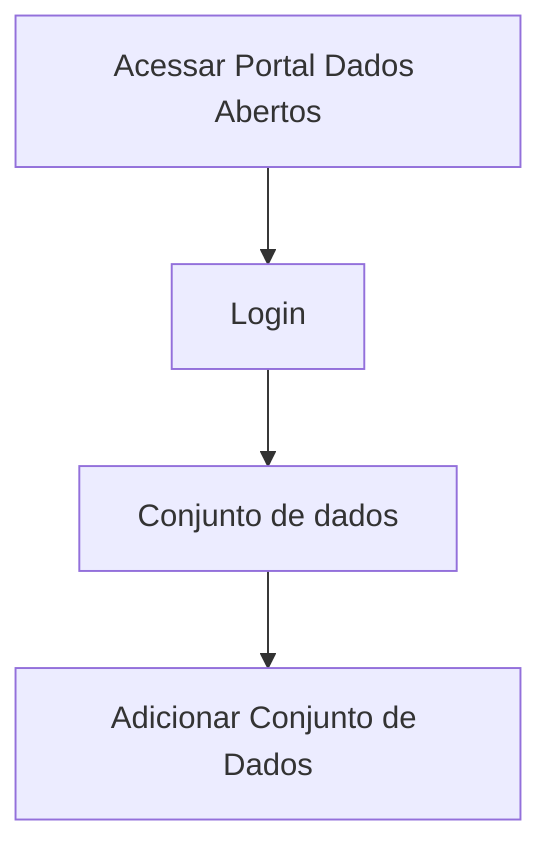
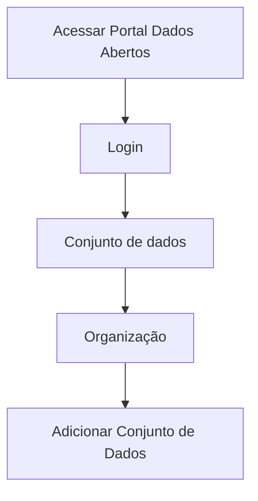

# Edição do conjunto de dados

**Como** publicador, **eu quero**  editar os metadados do conjunto de dados **para** que eu possa melhor documentar o mesmo, antes de avançar para a aba de Adicionar Dados.

- **Acesso 1:**

- **Acesso 2:**

- **Perfil de acesso:** Publicador. 

- **Testes:** [Resultados Obtidos](../../../testes/sprint_04/06_edicao_do_conjunto_de_dados_casos_de_teste/#resultados-obtidos).

- **Status:** Em revisão.

## Critérios de aceite
Para que seja feito a edição dos dados do conjunto, o portal deve se comportar conforme as critérios de aceite abaixo:

### **Critério 001 – Editar Metadados de arquivo(s) de dados:**
- **Dado** que quero fazer a edição dos metadados conjunto de dados.
- **Quando** aciono o botão `Criar Conjunto de Dados`.
- **Então** o sistema apresenta os campos para fazer a edição dos dados.

#### **Regra negocial 001.001**: 
Manter a conformidade com a especificação da [Frictionless](https://specs.frictionlessdata.io/#overview).

#### **Regra negocial 001.002**: 
Possibilitar ao Administrador do Portal (que vai instalar a biblioteca) a opção de configurar os campos/propriedades da biblioteca informando os campos que deverão ser de preenchimento obrigatório. Os campos configuráveis serão os listados abaixo, devendo esta informação constar nas instruções de instalação da biblioteca:

- Title.
- Description.
- Visibility.
- Type.
- License.
- Source.
- Version.
- Author.name.
- Author.email.
- Author.url.

#### **Regra negocial 001.003**: 
Possibilitar ao Administrador do Portal (que vai instalar a biblioteca) a opção de configurar os campos/propriedades da biblioteca, informando quando os campos deverão ser restritos à edição. Os campos configuráveis serão os listados abaixo, devendo esta informação constar nas instruções de instalação da biblioteca:

- Title.
- Description.
- Visibility.
- Type.
- License.
- Source.
- Version.
- Author.name.
- Author.email.
- Author.url.

#### **Regra negocial 001.004**: 
Os campos dos formulários deverão estar em conformidade com a especificação da Frictionless e à configuração do Administrador do Portal.

#### **Regra negocial 001.005**: 
O campo **URL** deverá ser obrigatório e preenchido automaticamente ao digitar o campo titulo, utilizando o hífen como separador.

#### **Regra negocial 001.006**: 
O campo Organização deve ser de preenchimento obrigatório.

#### **Regra negocial 001.007**: 
Quando o usuário estiver submetido a apenas uma organização, 
o campo deve vir preenchido e sem a possibilidade de alteração. 

#### **Regra negocial 001.008**: 
Quando o usuário estiver submetido a mais de uma organização, deverá ser mantido o campo busca das organizações vinculadas ao usuário dentro da combobox da Organização, e como padrão a opção **selecione**. 

#### **Regra negocial 001.009**: 
No campo `Visibilidade`, a combobox tem a seguinte apresentação:

- Deverão conter as opções *Privada* e *Pública* 
- Por padrão, deverá vir selecionada a opção *Privada*, podendo ser editável, a depender da configuração do Administrador do Portal. 

#### **Regra negocial 001.010**: 
A combobox `Frequência de Atualização` deverá conter as seguintes informações: diário, semanal, quinzenal, mensal, bimestral, trimestral, anual, sob demanda e como padrão a opção **selecione**.

#### **Regra negocial 001.011**: 
O campo `Licença` deverá ser do tipo combobox e deverão vir de acordo com as especificações da Frictionless.

#### **Regra negocial 001.012**: 
O sistema deverá apresentar o primeiro campo `Contribuidores` em tela, com as informações do publicador e e-mail, sem a possibilidade de alteração.

#### **Regra negocial 001.013**:
Os campos para edição dos dados do conjunto deverão obedecer as regras descritas para os mesmos na tabela abaixo.

## Prototipação

- [Prototipo baixa fidelidade](/assets/pdfs/prototipo_telas_ckan.pdf)

| Item | Nome do Campo              | Tipo de Dado[^2] | Opções/Domínio | Descrição/Observações                                                                                     |   |
|------|----------------------------|------------------|----------------|-----------------------------------------------------------------------------------------------------------|---|
| 1    | Título                     | O, CT            | N/A            | Campo título sem limitação de quantidade de caracteres.                                                   |   |
| 2    | URL                        | O, CT            | N/A            | Campo URL deverá ser preenchido automaticamente após digitar no campo título.                             |   |
| 3    | Descrição                  | O, CT            | N/A            | Campo descrição sem limitação de quantidade de caracteres.                                                |   |
| 4    | Organização                | O, CB            | N/A            | Seleção da organização na qual o usuário logado faz parte.                                                |   |
| 5    | Visibilidade               | CB               | N/A            | Seleção do tipo de visibilidade: Privada ou Pública.                                                      |   |
| 6    | Tipo                       | CB               | N/A            | Selecionar o tipo de arquivo: Tabular ou não tabular.                                                     |   |
| 7    | Licença                    | CB               | N/A            | Campo licença deverá vir com as especificações da Frictionless.                                           |   |
| 8    | Fonte                      | CT               | N/A            | Campo para descrever a fonte da informação (url).                                                         |   |
| 9    | Versão                     | A                | N/A            | Campo para informar a versão do documento.                                                                |   |
| 10   | Publicador                 | O, CT            | N/A            | Campo que informa o nome do Publicador (usuário logado) do Conjunto.                                      |   |
| 11   | E-mail                     | O, CT            | N/A            | Campo que informa o e-mail do Publicador do Conjunto.                                                     |   |
| 12   | URL                        | CT               | N/A            | Campo que informa a URL do Publicador do Conjunto.                                                        |   |
| 13   | Autor                      | O, CT            | N/A            | Campo que informa o nome do Autor do Conjunto                                                             |   |
| 14   | E-mail                     | O, CT            | N/A            | Campo que informa o e-mail do Autor do Conjunto                                                           |   |
| 15   | URL                        | CT               | N/A            | Campo que informa a URL do Autor do Conjunto.                                                             |   |
| 16   | (+) Adicionar contribuidor | B                | N/A            | Botão para adicionar mais um contribuidor.                                                                |   |
| 17   | Frequência de Atualização  | CB               | N/A            | Seleção da frequência em que o Conjunto será atualizado.                                                  |   |
| 18   | Palavras-Chave             | CT               | N/A            | Campo para informar as palavras-chave que compõe aquele determinado conjunto, sendo separado por vírgula. |   |
| 19   | (+) Adicionar propriedade  | B                | N/A            | Botão para Adionar outras propriedades extras.                                                            |   |

[^2]: [Tipos de dados](../../modelos/tipos_dado_formulario_html.md)