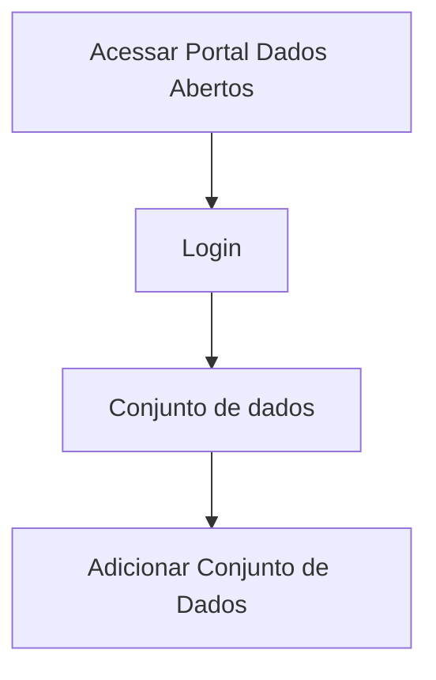

# Validação do conjunto de dados

**Como** publicador, **eu quero**  validar os metadados do conjunto de dados  **para** que eu faça a publicação do mesmo no Portal.

- **Acesso:** 

- **Perfil de acesso:** Publicador. 

- **Testes:** [Resultados Obtidos](../../../testes/sprint_04/07_validacao_de_dados_do_conjunto_do_recurso_casos_de_teste/#resultados-obtidos).

- **Status:** Em revisão.

## Critérios de aceite
Para que seja feito a edição dos dados do conjunto, o portal deve se comportar conforme as critérios de aceite abaixo:

### **Critério 001 – Validar Metadados Conjunto**
- **Dado** eu quero idenficar inconsistências antes de publicar informações no Portal.
- **E** aciono o botão `Publicar`.
- **Então** os metadados do conjunto documentado deverão ser validados.

#### **Regra negocial 001.001**: 
Manter a conformidade com a especificação da [Frictionless](https://specs.frictionlessdata.io/#overview).

#### **Regra negocial 001.002**: 
Todos os campos serão validados de acordo com as especificações da Frictionless.

#### **Regra negocial 001.003**: 
Além da validação frictionless o sistema deverá validar campos cujo o preenchimento seja obrigatório segundo arquivo de configuração utilizado durante instalação da extensão.

> Regra Negocial DTA: 

> Campos Title, Description, Visibility, Type, License, Author.name e Author.email são obrigatórios e editáveis.

#### **Regra negocial 001.004**: 
O resultado positivo da validação de qualquer propriedade não é condição para o usuário prosseguir para a publicação do Conjunto de dados. 

#### **Regra negocial 001.005**: 
O resultado da validação fica referenciável por hiperlink em uma badge de validação e armazenado em página estática de acordo com framework da Fricitonless. 

#### **Regra negocial 001.006**: 
Os relatórios de validação serão armazenados no ckan/portal de dados.  

#### **Regra negocial 001.007**: 
Não haverá limite de tempo para armazenamento da página estática de resultado do relatório de validação do conjunto de dados.
 
### Prototipo Baixa Fidelidade

[Link para prototipacao](/assets/pdfs/prototipo_telas_ckan.pdf)

| Item | Nome do Campo              | Tipo de Dado | Opções/Domínio | Descrição/Observações                                                                                     |   |
|------|----------------------------|------------------|----------------|-----------------------------------------------------------------------------------------------------------|---|
| 1    | Título                     | O, CT            | N/A            | Campo título sem limitação de quantidade de caracteres.                                                   |   |
| 2    | URL                        | O, CT            | N/A            | Campo URL deverá ser preenchido automaticamente após digitar no campo título.                             |   |
| 3    | Descrição                  | O, CT            | N/A            | Campo descrição sem limitação de quantidade de caracteres.                                                |   |
| 4    | Organização                | O, CB            | N/A            | Seleção da organização na qual o usuário logado faz parte.                                                |   |
| 5    | Visibilidade               | CB               | N/A            | Seleção do tipo de visibilidade: Privada ou Pública.                                                      |   |
| 6    | Tipo                       | CB               | N/A            | Selecionar o tipo de arquivo: Tabular ou não tabular.                                                     |   |
| 7    | Licença                    | CB               | N/A            | Campo licença deverá vir com as especificações da Frictionless.                                           |   |
| 8    | Fonte                      | CT               | N/A            | Campo para descrever a fonte da informação (url).                                                         |   |
| 9    | Versão                     | A                | N/A            | Campo para informar a versão do documento.                                                                |   |
| 10   | Publicador                 | O, CT            | N/A            | Campo que informa o nome do Publicador (usuário logado) do Conjunto.                                      |   |
| 11   | E-mail                     | O, CT            | N/A            | Campo que informa o e-mail do Publicador do Conjunto.                                                     |   |
| 12   | URL                        | CT               | N/A            | Campo que informa a URL do Publicador do Conjunto.                                                        |   |
| 13   | Autor                      | O, CT            | N/A            | Campo que informa o nome do Autor do Conjunto                                                             |   |
| 14   | E-mail                     | O, CT            | N/A            | Campo que informa o e-mail do Autor do Conjunto                                                           |   |
| 15   | URL                        | CT               | N/A            | Campo que informa a URL do Autor do Conjunto.                                                             |   |
| 16   | (+) Adicionar contribuidor | B                | N/A            | Botão para adicionar mais um contribuidor.                                                                |   |
| 17   | Frequência de Atualização  | CB               | N/A            | Seleção da frequência em que o Conjunto será atualizado.                                                  |   |
| 18   | Palavras-Chave             | CT               | N/A            | Campo para informar as palavras-chave que compõe aquele determinado conjunto, sendo separado por vírgula. |   |
| 19   | (+) Adicionar propriedade  | B                | N/A            | Botão para Adicionar outras propriedades extras.                                                            |   |