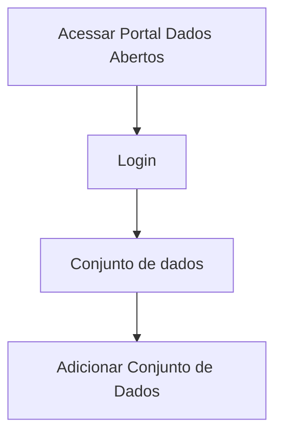

# Publicação do conjunto de dados

**Como** publicador, **eu quero**  publicar meu conjunto de dados  **para** que seja feita a divulgação das informações do mesmo no Portal. 

- **Acesso:** 

- **Perfil de acesso:** Publicador. 

- **Testes:** [Resultados Obtidos](../../../testes/sprint_04/08_publicacao_do_conjunto_do_recurso_casos_de_teste/#resultados-obtidos).

## Critérios de aceite
Para que seja feito a publicação do conjunto, o portal deve se comportar conforme as critérios de aceite abaixo:

### **Critério 001 – Publicar Conjunto de Dados**

- **Dado**  que fiz, ao menos, uma validação dos metadados dos recursos e do conjunto
- **E** todos os campos obrigatórios estão preenchidos. 
- **Quando** aciono o botão `Publicar Conjunto de Dados`.
- **Então** Publica o conjunto e redireciona para a página do conjunto publicada. 	

#### **Regra negocial 001.001**: 
Para que haja a publicação do conjunto de dados é necessário que seja feita a validação de todo o conjunto e seu(s) recurso(s). 

#### **Regra negocial 001.002**: 
O resultado positivo da validação de qualquer propriedade não é condição para o usuário prosseguir para a publicação do Conjunto de dados. 

#### **Regra negocial 001.003**: 
O sistema deverá solicitar a confirmação da publicação nos casos de resultado negativo da validação. 

#### **Regra negocial 001.004**: 
Para habilitar o botão de `Publicar Conjunto de Dados` deverá, ao menos uma vez, acionar o botão de validação. 

#### **Regra negocial 001.005**: 
Ao acionar o botão de `Publicar Conjunto de Dados` o sistema deverá redirecionar o usuário para a tela do novo conjunto publicado. 

#### **Regra negocial 001.006**: 
Ao acionar o botão de `Publicar Conjunto de Dados` o sistema deverá redirecionar o usuário para a tela do novo conjunto publicado. 

#### **Regra negocial 001.006**: 
Após acionar o botão de `Publicar Conjunto de Dados` o sistema deverá gerar aba para consultar validações do conjunto e seu(s) recurso(s). 

#### **Regra negocial 001.007**: 
Após acionar o botão de `Publicar Conjunto de Dados` o sistema deverá atualizar metadados visualizados no endpoint `package_show` da api CKAN[^2] com os metadados criados pelo usuário, package e resources. 

### Prototipo Baixa Fidelidade

[Link para prototipacao](/assets/pdfs/prototipo_telas_ckan.pdf)

| Item |                        Nome do Campo                        | Tipo de Dado[^3] | Opções/Domínio |     Descrição/Observações      |
|------|-------------------------------------------------------------|------------------|----------------|--------------------------------|
|    1 | Dic. Dados:	Nome do Recurso        | O, CT              | N/A            | Descrição manual do nome do Recurso.|
|    2 | Dic. Dados:Título                 | CT              | N/A            | Campo texto para o título do recurso com tamanho máximo de 100 caracteres       |
|    3 | Dic. Dados:Descrição | CT         | N/A            |Campo texto para a descrição do recurso com tamanho máximo de 5000 caracteres |
|    4 | Dic. Dados:Tipo de Dado  | CB              | N/A            | Seleção automática do tipo possível de dados como: texto, número, etc. |
|    5 | Dic. Dados:Formato de dado       | CB                | N/A            | Seleção automática com os formatos de dados predeterminados, como: padrão, e-mail, etc.|
|    6 | Dic. Dados:Obrigatório    | CB                | N/A            | Por padrão, a opção `NÃO` deverá estar selecionada. Estende-se para estória: [US003 - Editar Metadados](/estorias_de_usuarios/03_edicao_dos_dados_do_recurso) |
|    7 | Dic. Dados:Único       | CB                | N/A            | Por padrão, a opção `NÃO` deverá estar selecionada. Estende-se para estória: [US003 - Editar Metadados](/estorias_de_usuarios/03_edicao_dos_dados_do_recurso)                        | B                | N/A            | Adiciona novo arquivo(s) de dados          |
|    8 |Dic. Dados:(+) Adicionar Metadados   | B                | N/A            | Escolha de metadados complementares. [US003 - Editar Metadados](/estorias_de_usuarios/03_edicao_dos_dados_do_recurso)       |
|    09 | Dic. Dados:Salvar   | B                | N/A            | Ao acionar o botão <<Salvar>> o sistema salva as alterações feitas. Estende-se para estória: [US003 - Editar Metadados](/estorias_de_usuarios/03_edicao_dos_dados_do_recurso)  |
|    10 | Dados do Recurso: Tipo de formato      | CB                | N/A            | Seleção automática do tipo de extensão: Tabular ou não tabular |
|   11 |Dados do Recurso: Formato do recurso  | CB       | N/A            | Seleção automática do formato do recurso, como: xls, csv, etc.     |
|   12 | Dados do Recurso: Codificação   | CB                | N/A            | Descrição manual do tipo de codificação, como UTF-8, etc |

[^1]: [Proposta de implementação desta funcionalidade via Frictionless](https://github.com/frictionlessdata/framework/issues/475)
[^2]: https://DOMINIO/api/3/action/package_show?id=PACKAGE-ID
[^3]: [Tipos de dados](../../modelos/tipos_dado_formulario_html.md)