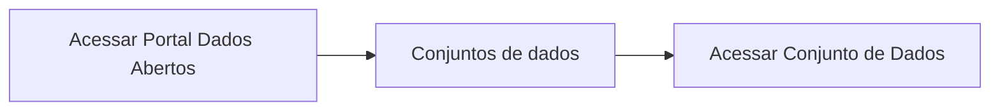

# Mergear os metadados do CKAN com os da Frictionless

**Como** um usuário externo, **eu quero** ter acesso a link único do datapackage.json **para** utilizar scripts de programação durante a utilização dos dados.

- **Acesso:** 

- **Perfil de acesso:** Usuário Externo.

- **Testes:** [Resultados Obtidos](../../../testes/sprint_05/10_mergear_os_metadados_do_CKAN_com_os_da_frictionless_casos_de_teste/#resultados-obtidos).

## Critérios de aceite
Para que seja feito a publicação do recurso, o portal deve se comportar conforme as critérios de aceite abaixo:

### **Critério 001 – Publicar Conjunto de Dados**

- **Dado** que eu quero visualizar as informações do conjunto.
- **E** utilizar scripts automatizados. 
- **Quando** acesso a página do conjunto
- **Então** cesso a link único da documentação via datapackage.json	

#### **Regra negocial 001.001**: 
Manter a conformidade com a especificação da [Frictionless](https://specs.frictionlessdata.io/#overview).

#### **Regra negocial 001.002**: 
Link não deverá sofrer alteração após edição do conjunto.

### Prototipo Baixa Fidelidade

[Link para prototipacao](/assets/pdfs/prototipo_telas_ckan.pdf)

| Item |                        Nome do Campo                        | Tipo de Dado[^1] | Opções/Domínio |     Descrição/Observações      |
|------|-------------------------------------------------------------|------------------|----------------|--------------------------------|
|    1 | Dic. Dados:	Nome do Recurso        | O, CT              | N/A            | Descrição manual do nome do Recurso.|
|    2 | Dic. Dados:Título                 | CT              | N/A            | Campo texto para o título do recurso com tamanho máximo de 100 caracteres       |
|    3 | Dic. Dados:Descrição | CT         | N/A            |Campo texto para a descrição do recurso com tamanho máximo de 5000 caracteres |
|    4 | Dic. Dados:Tipo de Dado  | CB              | N/A            | Seleção automática do tipo possível de dados como: texto, número, etc. |
|    5 | Dic. Dados:Formato de dado       | CB                | N/A            | Seleção automática com os formatos de dados predeterminados, como: padrão, e-mail, etc.|
|    6 | Dic. Dados:Obrigatório    | CB                | N/A            | Por padrão, a opção `NÃO` deverá estar selecionada. Estende-se para estória: [US003 - Editar Metadados](/estorias_de_usuarios/03_edicao_dos_dados_do_recurso) |
|    7 | Dic. Dados:Único       | CB                | N/A            | Por padrão, a opção `NÃO` deverá estar selecionada. Estende-se para estória: [US003 - Editar Metadados](/estorias_de_usuarios/03_edicao_dos_dados_do_recurso)                        | B                | N/A            | Adiciona novo arquivo(s) de dados          |
|    8 |Dic. Dados:(+) Adicionar Metadados   | B                | N/A            | Escolha de metadados complementares. [US003 - Editar Metadados](/estorias_de_usuarios/03_edicao_dos_dados_do_recurso)       |
|    09 | Dic. Dados:Salvar   | B                | N/A            | Ao acionar o botão <<Salvar>> o sistema salva as alterações feitas. Estende-se para estória: [US003 - Editar Metadados](/estorias_de_usuarios/03_edicao_dos_dados_do_recurso)  |
|    10 | Dados do Recurso: Tipo de formato      | CB                | N/A            | Seleção automática do tipo de extensão: Tabular ou não tabular |
|   11 |Dados do Recurso: Formato do recurso  | CB       | N/A            | Seleção automática do formato do recurso, como: xls, csv, etc.     |
|   12 | Dados do Recurso: Codificação   | CB                | N/A            | Descrição manual do tipo de codificação, como UTF-8, etc |

[^1]: [Tipos de dados](../../modelos/tipos_dado_formulario_html.md)

