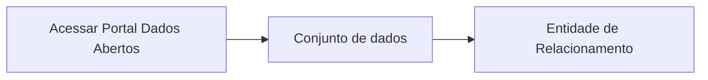

# Gerar hiperlink sobre cada entidade que será direcionado à página do recurso

**Como** um usuário externo, **eu quero** clicar sobre o hiperlink do diagrama de entidade de relacionamento **para** que eu possa ser direcionado à página do recurso acionado. 

- **Acesso:** 

- **Perfil de acesso:** usuário externo
- **Protótipo:** Baixa Fidelidade.

- **Regra negocial:** Para que seja gerada a entidade de relacionamento da página do conjunto, o portal deve se comportar conforme as regras abaixo:
       - **RN001** - 
	   - **RN002:** - 
	   - **RN003:** - 
          - **RN004:** - 
 	   - **RN005:** - 
	   - **RN006:** - 

### Critérios de aceite

- **Critério 001 –** 
       - **Dado** 
       - **Quando** 
       - **Então** 

- **Critério 002 –** 
	   - **Dado** 
	   - **E** 
	   - **Quando** - 
	   - **Então** 

- **Critério 003 –** 
	   - **Dado** 
	   - **Quando** 
	   - **Então** 

### Prototipo Baixa Fidelidade

[Link para prototipacao de baixa fidelidade](link_para_prototipo_baixa_fidelidade)

### Prototipo Alta Fidelidade

[Link para prototipacao de alta fidelidade](link_para_prototipo_alta_fidelidade) 
### Imagens protótipo Baixa Fidelidade

| Item |                        Nome do Campo                        | Tipo de Dado[^2] | Opções/Domínio |     Descrição/Observações      |
|------|-------------------------------------------------------------|------------------|----------------|--------------------------------|
|    1 |           |            |              |                    |
|    2 |           |            |              |                    |                
|    3 |           |            |              |                    |
|    4 |           |            |              |                    |
|    5 |           |            |              |                    |
|    6 |           |            |              |                    |

[^1]: [Estoria será criada na Sprint06](www.dados.mg.gov.br)
[^2]: [Tipos de dados](../modelos/tipos_dado_formulario_html.md)