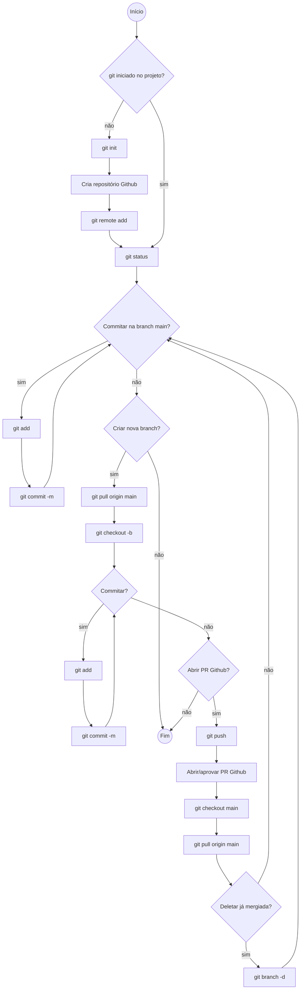

# Git e Github Cheat Sheet

Materiais de referência:

- [The only git cheat sheet you need](https://medium.com/@annamedyukh/the-only-git-cheat-sheet-you-need-9dce3ccc4036)
- [Git Infográfico](https://res.cloudinary.com/practicaldev/image/fetch/s--Zib71Fgv--/c_limit%2Cf_auto%2Cfl_progressive%2Cq_auto%2Cw_880/https://dev-to-uploads.s3.amazonaws.com/uploads/articles/n082uxea33j6zq3mca7u.png)

Fluxo sugerido

    