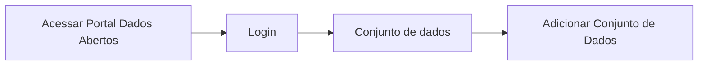

# Modelo Estória de Usuário

**Como** `definir quem é o ator` **eu quero** `definir qual é o objetivo` **para** `É a justificativa para o objetivo`

- **Acesso:** 

- **Perfil de acesso:** `Ator` 
- **Protótipo:** Baixa Fidelidade.
- **Regra negocial:** Para que seja feita a estoria de usuário, o portal deve se comportar conforme as regras abaixo:
       - **RN001:** 	
       - **RN002:** 
       - **RN003:** 
       - **RN004:** 
 	   - **RN005:** 
	   - **RN006:** 

### Critérios de aceite

- **Critério 001 –**
       - **Dado** `Pré-condição do cenário, em que ponto ele se inicia`
       - **Quando** `Ação que está sendo desempenhada`
       - **Então** `Resultado esperado de suas ações`

- **Critério 002 –**
	   - **Dado** 
	   - **E** 
	   - **Então** 

- **Critério 003 –**
	   - **Dado** 
	   - **Quando** 
	   - **E**
	   - **Então** 

- **Critério 004 –**
	   - **Dado** 
	   - **Quando** 
	   - **Então** 

### Prototipo Baixa Fidelidade

[Link para prototipacao de baixa fidelidade](link_para_prototipo_baixa_fidelidade)

### Prototipo Alta Fidelidade

[Link para prototipacao de alta fidelidade](link_para_prototipo_alta_fidelidade) 
### Imagens protótipo Baixa Fidelidade

| Item |                        Nome do Campo                        | Tipo de Dado[^1] | Opções/Domínio |     Descrição/Observações      |
|------|-------------------------------------------------------------|------------------|----------------|--------------------------------|
|    1 |           |            |              |                    |
|    2 |           |            |              |                    |                
|    3 |           |            |              |                    |
|    4 |           |            |              |                    |
|    5 |           |            |              |                    |
|    6 |           |            |              |                    |

[^1]: [Tipos de dados](../modelos/tipos_dado_formulario_html.md)